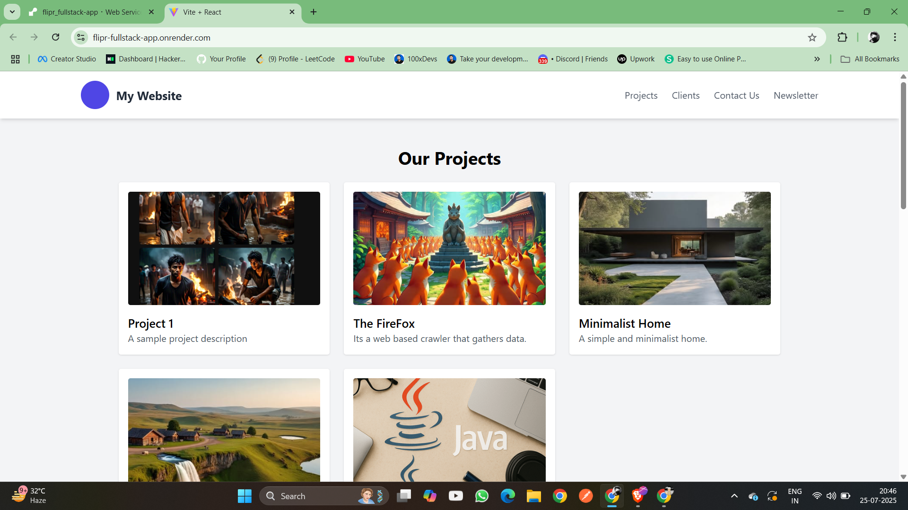
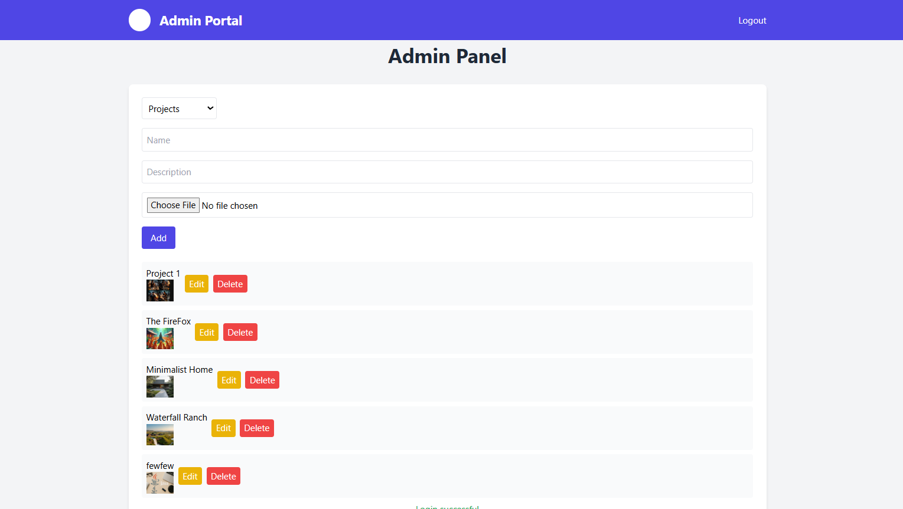

# Fullstack App\n\nA MERN full-stack application for a placement drive, including a landing page and admin panel.
# Full-Stack Project

This is a full-stack web application built with React for the frontend, Node.js with Express for the backend, and MongoDB for the database. It features a public landing page and a secure admin panel for managing projects, clients, contacts, and subscriptions.

## Features
- **Landing Page**: Displays projects and clients, with forms for contact submissions and newsletter subscriptions.
- 

- **Admin Panel**: Secure interface to add, edit, and delete projects, clients, contacts, and subscriptions.
- 


## URLs
- **Main URL**: [https://flipr-fullstack-app.onrender.com/](https://flipr-fullstack-app.onrender.com/)
- **Admin URL**: [https://flipr-fullstack-app.onrender.com/admin](https://flipr-fullstack-app.onrender.com/admin)

## Prerequisites
- Node.js
- npm
- MongoDB (local or remote)
- Git

## Installation
1. Clone the repository:
   ```bash
   git clone https://github.com/your-username/your-repo.git
   cd your-repo
